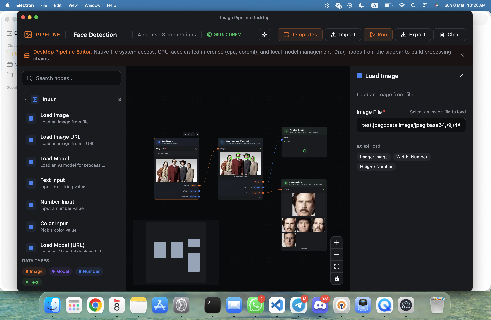

<p align="center">
  
</p>

<h1 align="center">Image Pipeline</h1>

<p align="center">
  <b>Open-source, node-based image & video processing desktop app</b><br/>
  Chain together 60+ operations — YOLO detection, face detection, background removal, AI upscaling, live webcam streams, video encoding, and more. No code required.
</p>

<p align="center">
  
  
  
  
  
</p>

<p align="center">
  <a href="#-quick-start">Quick Start</a> &bull;
  <a href="#-features">Features</a> &bull;
  <a href="#-all-nodes-60">All Nodes</a> &bull;
  <a href="#%EF%B8%8F-architecture">Architecture</a> &bull;
  <a href="#-contributing">Contributing</a>
</p>

---

## Why Image Pipeline?

Tired of writing one-off Python scripts or opening Photoshop every time you need to batch-process images? Image Pipeline gives you a **visual, drag-and-drop editor** where you wire up processing steps as nodes. Set up a pipeline once — use it forever.

- **No code** — build complex pipelines visually
- **Real-time preview** — see results instantly as you tweak parameters
- **Batch processing** — drag a folder in and process thousands of images
- **Live webcam/stream** — run YOLO detection or filters on a live video feed
- **Fully offline** — everything runs locally, your images never leave your machine
- **GPU accelerated** — CUDA, Metal, and ONNX Runtime support

---

## Quick Start

```bash
git clone https://github.com/awaisshah228/image-pipeline-electron.git
cd image-pipeline-electron

# Automated setup (checks Python, creates venv, installs everything)
chmod +x setup-dev.sh && ./setup-dev.sh

# Launch the app
npm run dev:full
```

> Requires **Node.js 18+**, **Python 3.8+**, and **ffmpeg** (optional, for video encoding).

<details>
<summary><b>Install ffmpeg</b></summary>

```bash
# macOS
brew install ffmpeg

# Ubuntu / Debian
sudo apt install ffmpeg

# Windows
winget install ffmpeg
```

Without ffmpeg, the app falls back to the browser's MediaRecorder API (lower quality WebM). For H264 MP4 output, install ffmpeg.

</details>

<details>
<summary><b>Manual setup (step by step)</b></summary>

### 1. Install Node dependencies

```bash
npm install
```

### 2. Setup Python backend

```bash
cd python-backend
python3 -m venv venv
source venv/bin/activate       # macOS / Linux
# venv\Scripts\activate        # Windows
pip install --upgrade pip
pip install -r requirements.txt
```

Verify:
```bash
python -c "import sanic, numpy, cv2, PIL, ultralytics, onnxruntime, psutil, rembg; print('All good')"
```

### 3. Run

```bash
npm run dev:full    # Full stack (backend + Vite + Electron)
```

| Command | What it starts |
|---------|---------------|
| `npm run dev:full` | Python backend + Vite + Electron (recommended) |
| `npm run dev` | Vite dev server only (`http://localhost:5173`) |
| `npm run electron:dev` | Vite + Electron (backend auto-starts on demand) |
| `npm run backend:start` | Python Sanic server only |

</details>

---

## Features

### Visual Pipeline Editor
- **Drag & drop** nodes from the sidebar to build processing chains
- **Type-safe connections** — only compatible ports can connect
- **Real-time preview** on every node
- **Undo/Redo** with full history (Ctrl+Z / Ctrl+Shift+Z)
- **Pipeline templates** — one-click presets for common workflows
- **Fused execution** — multi-node chains execute in a single HTTP call (zero extra round-trips)

### Object Detection & Computer Vision
- **YOLO Detection** (YOLOv5 / v8 / v11) with confidence threshold, IOU control, and class filtering
- **Face Detection** using Haar Cascades — outputs annotated image + cropped faces
- **People Detection** (HOG + SVM) — no model download needed
- **Contour Detection** — outline, filled, or background subtraction modes
- **Canny / Sobel / Laplacian** edge detection
- **Color Detection** — find specific colors with tolerance
- **Adaptive Threshold** and **Morphology** operations (dilate, erode, open, close)
- **Custom Cascade Detector** — bring your own Haar/LBP XML files

### AI-Powered Processing
- **Background Removal** — BiRefNet, u2net, isnet, silueta, bria-rmbg with alpha matting
- **Smart Select (SAM)** — MobileSAM interactive segmentation, click to select objects
- **AI Upscaling** — Real-ESRGAN 2x/4x, ESRGAN, SwinIR, BSRGAN, SPAN, HAT, DAT
- **Face Restoration** — GFPGAN, CodeFormer, RestoreFormer
- **Depth Estimation** — MiDaS / Depth Anything depth maps
- **Style Transfer** — apply artistic styles to images
- **Colorization** — AI grayscale-to-color
- **Inpainting** — AI fill for masked regions
- **Model Interpolation** — blend weights between two upscale models

### Live Webcam & Streaming
- **Webcam capture** with configurable FPS (1–30)
- **HLS / MJPEG stream** support — connect to IP cameras or any stream URL
- **Real-time processing** — run YOLO, filters, or any pipeline on live frames
- **3-phase video pipeline**:
  1. **Capture** — raw frames saved to disk with drift-compensated timing
  2. **Process** — batch-process all frames through your pipeline
  3. **Encode** — ffmpeg combines processed frames into video

### Image Operations (40+)
- **Transform** — Resize, Crop, Rotate, Flip, Pad/Border, Tile/Split, Tile Merge
- **Adjust** — Brightness/Contrast, Hue/Saturation, Color Balance, Levels, Invert, Grayscale, Opacity
- **Filter** — Blur (Gaussian/Box/Motion/Median), Sharpen, Denoise, Edge Detect, Threshold, Pixelate, High Pass, Add Noise, Surface Blur
- **Channel** — Split RGB, Channel Mixer, Chroma Key (green/blue screen removal)
- **Composite** — Blend modes (Normal, Multiply, Screen, Overlay, Soft Light, Hard Light, Difference, Add, Subtract), Stack Images, Add Caption

### Batch & Video Processing
- **Batch Load** — load entire directories with glob patterns + recursive search
- **Batch Save** — export to PNG, JPEG, WebP, TIFF, BMP with quality control
- **Video Frame Extraction** — configurable FPS, max resolution downscaling, disk caching
- **Video Encoding** — H264 / VP9 / VP8 with configurable bitrate and FPS
- **Iterator / Collector** — loop through image lists or gather results

### Model & GPU Management
- **ONNX Runtime** inference with provider selection (CPU, CUDA, MPS, CoreML)
- **Model Manager** — import, list, delete custom .onnx models
- **On-demand downloads** — AI models download only when first used
- **Session caching** for fast repeated inference
- **Custom API endpoints** — connect to Replicate, HuggingFace, RunPod, Modal, or any REST API

---

## All Nodes (60+)

| Category | Nodes |
|----------|-------|
| **Input** | Load Image, Load Image URL, Load Model, Load Model (URL), Text Input, Number Input, Color Input, API Process Image |
| **Computer Vision** | YOLO Detection, Face Detection, People Detection, Contour Detection, Canny Edge, Color Detection, Adaptive Threshold, Morphology, Color Space, Bilateral Filter, Histogram EQ, Webcam/Stream Capture, Cascade Detector, Smart Select (SAM) |
| **AI Enhance** | Remove Background, Style Transfer, Colorize, Depth Map, Inpaint |
| **AI Upscale** | Upscale Image, Quick Upscale 2x, Quick Upscale 4x, Face Upscale, Interpolate Models |
| **Image Transform** | Resize, Crop, Rotate, Flip, Pad/Border, Tile/Split, Tile Merge |
| **Image Adjust** | Brightness/Contrast, Hue/Saturation, Color Balance, Levels, Invert, Grayscale, Opacity |
| **Image Filter** | Blur, Sharpen, Denoise, Edge Detect, Threshold, Pixelate, High Pass, Add Noise, Surface Blur |
| **Image Channel** | Split Channels, Channel Mixer, Chroma Key |
| **Composite** | Blend/Composite, Stack Images, Add Caption |
| **Batch/Video** | Batch Load, Batch Save, Load Video Frames, Save Video, Iterator, Collector |
| **Output** | Save Image, Preview Image, Image Info, Number Display, Image Gallery |
| **Utility** | Math, Text Append, Switch, Compare Images, Note |

---

## Architecture

```
┌──────────────────────────────────────────────────────────┐
│                    Electron App                           │
│                                                          │
│  ┌──────────────┐  ┌───────────────┐  ┌──────────────┐  │
│  │  React UI    │  │ Main Process  │  │   Preload    │  │
│  │  (Renderer)  │◄─┤  (Node.js)   │◄─┤   (IPC)      │  │
│  │              │  │               │  │              │  │
│  │  React Flow  │  │  File System  │  │  Bridge API  │  │
│  │  Zustand     │  │  ffmpeg       │  │              │  │
│  │  Pipeline    │  │  ONNX Runtime │  │              │  │
│  └──────┬───────┘  └───────────────┘  └──────────────┘  │
│         │                                                │
│         │  HTTP (localhost)                               │
│         ▼                                                │
│  ┌──────────────────────────────────────────────────┐    │
│  │            Python Backend (Sanic)                │    │
│  │                                                  │    │
│  │  YOLO Detection     OpenCV (40+ operations)      │    │
│  │  Pillow Transforms  AI Models (SAM, ESRGAN...)   │    │
│  │  Video Encoding     Background Removal           │    │
│  │  Batch Processing   GPU Acceleration             │    │
│  └──────────────────────────────────────────────────┘    │
└──────────────────────────────────────────────────────────┘
```

### How it works

1. **Pipeline Editor** — Visual node graph (React Flow + Zustand). Connect nodes to build processing chains. Node definitions are JSON-driven and extensible.

2. **Fused Execution** — The frontend collects the entire downstream chain and sends it as a **single HTTP call** to the Python backend. A 5-node chain = 1 request, not 5.

3. **Webcam Pipeline** — 3-phase architecture:
   - **Capture**: Raw frames saved to disk at target FPS with drift-compensated timing
   - **Process**: Python batch-processes all captured frames
   - **Encode**: ffmpeg combines processed frames into video

4. **Python Backend** — Sanic async HTTP server, auto-started by Electron. GPU-accelerated when CUDA/Metal is available.

### Key Files

```
electron/
  main.ts                 — Electron main process, window management
  preload.ts              — IPC bridge (renderer ↔ main)
  ipc/
    python-backend.ts     — Python process management + API forwarding
    gpu-inference.ts      — ONNX Runtime GPU inference
    file-system.ts        — File I/O + ffmpeg encoding
    model-loader.ts       — ML model management

src/
  lib/image-pipeline/
    pipeline-store.ts     — Zustand store: node graph, processing, webcam
    native-processor.ts   — Routes operations to Python backend
    webcam-processor.ts   — Webcam capture with disk-saving + live preview
    video-processor.ts    — Video frame extraction/encoding
    connection-validator.ts — Type-safe connection validation
    pipeline-templates.ts — Preset pipeline templates

python-backend/
  src/server.py           — Sanic server entry point
  src/routes/
    yolo.py               — YOLO object detection
    cv.py                 — OpenCV operations (40+)
    image.py              — PIL/Pillow operations
    pipeline.py           — Fused multi-step pipeline
    video.py              — Video frame extraction + encoding
    queue.py              — Async frame queue + SSE streaming
    models.py             — AI model management
    frames.py             — Frame save/load for streaming capture

public/image-pipeline-nodes/
  *.json                  — Node definitions (inputs, outputs, types, defaults)
```

---

## Build for Production

```bash
# macOS (DMG)
npm run electron:build:mac

# Windows (NSIS installer)
npm run electron:build:win

# Linux (AppImage)
npm run electron:build:linux
```

Output goes to the `release/` directory.

---

## GPU Support

| Platform | Provider | How |
|----------|----------|-----|
| **NVIDIA (Linux/Windows)** | CUDA | `onnxruntime-gpu` auto-installed. For YOLO: `pip install torch torchvision --index-url https://download.pytorch.org/whl/cu118` |
| **macOS (Apple Silicon)** | Metal/MPS | `onnxruntime` with CoreML provider. YOLO uses MPS automatically |
| **CPU** | Default | Works everywhere, no extra setup |

---

## Contributing

Contributions are welcome! Here are some ways to help:

- **Add new nodes** — Node definitions are just JSON files in `public/image-pipeline-nodes/`. Add a new JSON + backend handler and you've got a new node.
- **Improve existing operations** — Better algorithms, faster processing, more options
- **Bug fixes** — Found something broken? PRs welcome
- **Documentation** — Improve docs, add examples, write tutorials

```bash
# Fork & clone
git clone https://github.com/<your-username>/image-pipeline-electron.git

# Setup
chmod +x setup-dev.sh && ./setup-dev.sh

# Run
npm run dev:full
```

---

## License

MIT License with Anti-Plagiarism Clause — see [LICENSE](../LICENSE) for details.

Free to use, modify, and distribute. Redistribution under a different name/brand without attribution is prohibited.
